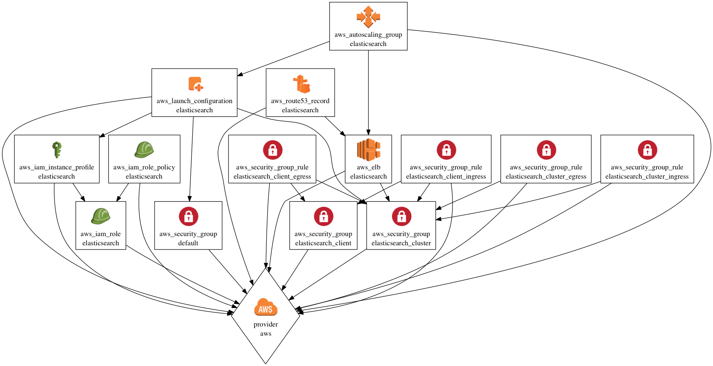

tf_aws_elasticsearch
====================

A Terraform module to create an elasticsearch cluster.




Usage
=====

```
module "elasticsearch" {
  source          = "git::https://github.com/TrueCar/tf_aws_elasticsearch.git"
  name            = "qa-logs-elasticsearch"
  vpc_id          = "vpc-12345678"
  subnet_ids      = "subnet-12345678,subnet-87654321"
  instance_type   = "m4.large"
  image_id        = "ami-12345678"
  key_pair_name   = "qa"
  user_data       = <<EOF
#!/bin/sh
# Configure Me.
EOF
  route53_zone_id = "ZONE0123456789"
  record_name     = "logs-cluster.qa.example.com"

}

```


Documentation
=============

[VARIABLES](VARIABLES.md)

[OUTPUTS](OUTPUTS.md)
